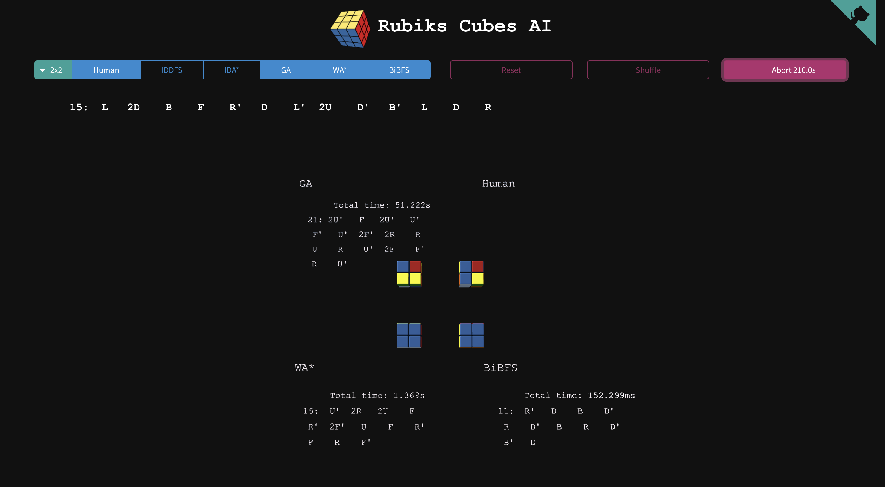
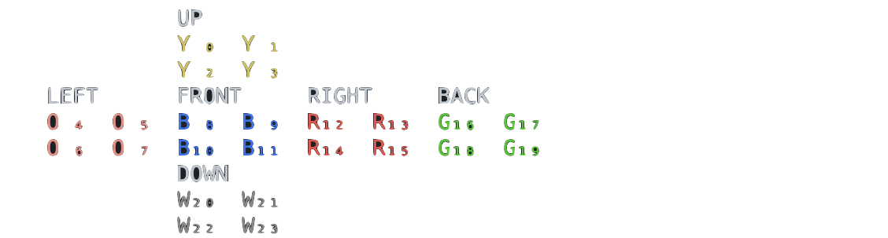
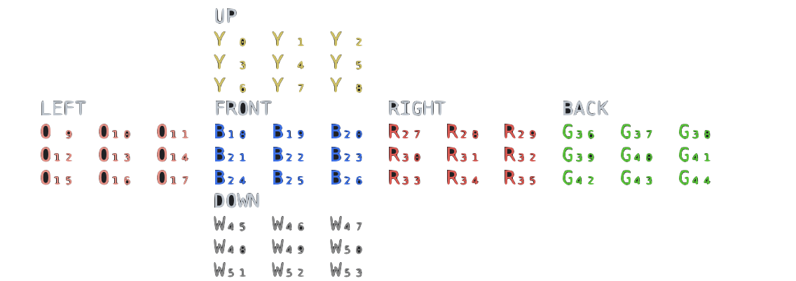
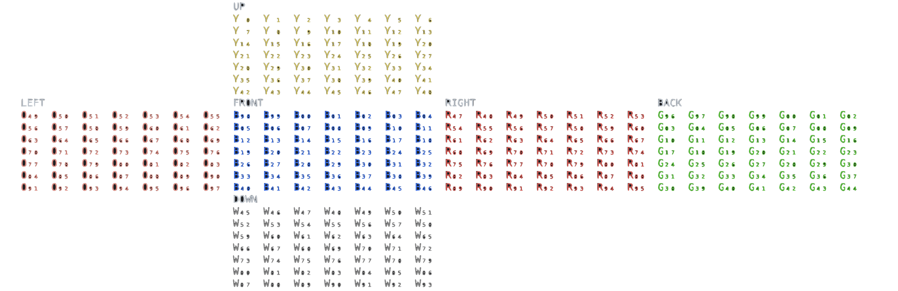

# Project

This project intends to make available, both for entertainment and for studies, several Rubik's cubes of different dimensions rendered in a three-dimensional canvas. Using the keyboard and mouse, you can rotate the cube's faces and change the camera.  
To run an algorithm, shuffle the cube, select a method and click 'solve'.

### Keys
Rotate the cube faces using the following keys: **W**, **A**, **S**, **D**, **F** and **X**: up, left, front, right, back, and down twists, respectively. Hold **Shift** for prime moves (counterclockwise). Use any numeric key to change the layer on which the rotation will be performed. The layer rotation is limited by the cube dimension (there is no way to rotate a middle layer in a 2x2 cube as it has no middle layer, for example).  

Press **\]** to quickly shuffle the cube, **\\** to restore its original configuration, and **enter** to start the algorithms.

To solve a cube using the keys, make sure the **Human** method is selected prior to the 'Solve' button click.

## Mouse
Use left button, right button and scroll to handle the camera.

## Goals
This project was created for fun and study purposes. These were the main objectives behind it:

1. Have fun. I have to confess, it's somewhat satisfying to watch these cubes rotate and solve themselves.
1. Study 3D in browser environments using [threejs](https://threejs.org/).
1. Solve a Rubik's cube with minimal human knowledge techniques:
      1. No previous set of rotations.
      1. No precomputed databases.  
            This feature makes it practically impossible to solve any other cube other than the pocket cube (2x2x2). Therefore, all other cubes are displayed for recreational purposes only.
1. Try different search algorithms and compare them.

# Rubik's cubes

## Twist notation
Rubik's cube's standard twist notation is: *U*, *L*, *F*, *R*, *B*, and D describe 90-degree clockwise twists of the up, left, front, right, back, and down faces, respectively. Adding an apostrophe indicates a counter-clockwise twist, so *U'* means twist the up face 90 degrees counter-clockwise. Prefixing a *2* to a move indicates a double 90-degree twist or a 180-degree twist; *2F* means twisting the front face twice. Larger cubes require an additional notation to describe intern layers notation. We achieve this by using subscript letters (*₁₂₃*...*₈₉*) to identify which layer was twisted, so *2D₂* means a 180-degree rotation of the second layer from the down face.

## Representation
There are several ways to represent a Rubik's cube as an object structure. Each one has its pros and cons and differs from the others in characteristics such as complexity, memory usage, and manipulation.

The one I chose represents all cubes with a unidimensional array, where every index contains the initial of the color it represents, and every index has a fixed position in the cube. For instance, the first item is always the up sticker of the back-left-top cubelet. 
The formula:  `(cube dimension * cube dimension) * 6` tells how many Bytes are needed to represent a single cube.

So the *2x2* cube is a 24-sized string; the *3x3* is a 54 one, the *4x4* a 96 one, and so on and so forth.

With that being said, the 2x2 cube  with the top and front faces being yellow and blue respectively is represented by the string: `YYYYOOOOBBBBRRRRGGGGWWWW`  

Distributed like this:  

The 3x3, also having the top and front faces being yellow and blue respectively, is:
So the pocket cube is the string: `YYYYYYYYYOOOOOOOOOBBBBBBBBBRRRRRRRRRGGGGGGGGGWWWWWWWWW`  
Distributed like this:

And, ultimately, just out of curiosity: `YYYYYYYYYYYYYYYYYYYYYYYYYYYYYYYYYYYYYYYYYYYYYYYYYOOOOOOOOOOOOOOOOOOOOOOOOOOOOOOOOOOOOOOOOOOOOOOOOOBBBBBBBBBBBBBBBBBBBBBBBBBBBBBBBBBBBBBBBBBBBBBBBBBRRRRRRRRRRRRRRRRRRRRRRRRRRRRRRRRRRRRRRRRRRRRRRRRRGGGGGGGGGGGGGGGGGGGGGGGGGGGGGGGGGGGGGGGGGGGGGGGGGWWWWWWWWWWWWWWWWWWWWWWWWWWWWWWWWWWWWWWWWWWWWWWWWW`  is the 7x7 cube solved.

Not the most efficient way, but it gets the job done. One small caveat of this approach is that there are 24 (6x4) ways to represent a solved cube because it doesn't accommodate the whole cube rotation. Still, it is a particularly good one because it is completely dissociated with the rendering object orientation, and it's easily cloned and handled. Since these are operations performed literally more than a million times, it's a good choice.

The rotation is then done by changing colors in the array with each other. Obviously, there is a [pattern that must be followed to achieve this](./src/engine/cubelets-creator.ts). Just keep in mind that the colors are changed, and the index stays the same.

If every tile of each face has a matching color, the cube is solved.

## Pocket cube (2x2) technicalities 
There is plenty of prior art in this space, and thanks to some key characteristics of a 2x2 Pocket Cube, optimally solving a given cube state is not too computationally intensive. The Pocket Cube consists of 8cubelet, each with three color stickers on them, resulting in 24 total stickers. Any permutation of the cubelets is possible, with seven of these being able to be independently oriented in three ways. If we fix one of these cubelets to a chosen position and orientation (essentially deeming it to be in a solved state); we can permit any permutation of the remaining seven cubelets and any orientation of six cubelets. This results in there only being 7! * 3⁶ = 3,674,160 possible unique states. This, in itself, makes it computationally feasible to visit each possible move sequence in an adequate time by any modern computer configuration.
    
The cube consists of 8 smaller cubelets, each one with 3 color stickers on it. Any permutation of the cubelets is possible, and 7 of them can be independently oriented in three ways. If we fix one cubelet to have a chosen position and orientation, we can allow any permutation of the remaining 7 cubelets and any orientation of 6 cubelets (the orientation of the first cubelet is fixed, 6 cubelets can be independently oriented, and the orientation of the last one is determined by the other). The number of possible states is:

    3,674,160
This is a fairly small amount of states, and it can be easily saved in computer memory, in which case the search algorithm becomes trivial. As the purpose of this experiment was to try different search algorithms, the amount of memory was intentionally limited.

In the case of a standard Rubik's cube, the number of possible states is vastly larger:

    43,252,003,274,489,856,000 (or 43 quintillion)

This is a manageably imaginable number. It's a little less than the square of the earth's population, for example. So, enumerating all the states is infeasible.

## Scrambling
The Rubik's cube scrambling problem a fascinating unsolved challenge. However, it becomes quite manageable if we turn our attention to a smaller 2x2 version, the Pocket cube.  
So how many moves should you use to fully scramble a pocket cube? The answer depends on how small you would like the distance to the solved state distribution to be d(t). However, it is certainly true that God's number, 14, of moves is insufficient. As a bare minimum, one should not use fewer than 19 moves.  
After 11 moves, d(t) is still very large, at 0.695. The first value of t that yields a d(t) value below 0.25 (often called "the mixing time" in Markov chain theory) is 19. After 25 moves d(t) is 0.092; after 50 moves it is 0.0012; and after 100 moves it is 0.00000017.  
All of this is needed to say that any shuffling with a random whole number of steps between 30 and 40 is good enough for the pocket cube.

## General solution approach
The pocket cube (2x2) has an interesting property of being able to be solved only by rotating 3 predefined faces. Note, the *L* move basically consists of an *R'* move and a new cube orientation (which is not a move, technically), so you don't need to do the L move at all. The same applies to the other 2 axes.

Since all the algorithms run against this cube, we cut down the branching to 6 (3 faces, 2 directions). One could even claim that *R'* is the same *3R*, as, in fact, it is. It would make the branching factor even smaller (3 faces, one direction), but the solutions found would be even farther from the optimal one. Another thing one can do to decrease the branching factor is to prune branches that undo the last action and branches that repeat the last action three times in a row. The first case is simply useless (*R* followed by *R'* is the same as doing nothing) whereas the second one would be previously visited by another branch (*RRR* is not needed since it was visited before by the branch *R'*). These clever beforehand prunes not only decrease the branching factor but also avoid easily detectable cycles in the search.

By taking advantage of this pocket cube-specific characteristic, most solutions fix a deliberately chosen cubelet - usually the Down-Back-Left one. By doing that one can solve a pocket cube rotating only three of the six faces, these being Up, Right, and Front. As long as the fixed cubelet remains static, a conventional Graph search algorithm over the search space can be applied, and it would provide us with an efficient means to reach a solution move sequence.

Given that, for a Pocket cube, God's number using quarter-turn metric is **14**. You'll often find that the path found by these algorithms is not optimal. Namely, **Genetic Algorithm**, **Simulated Annealing**, and **WA\*** don't find the best answer because they don't look for the best answer to solve the cube. They look for the fattest one to solve the cube with a given configuration and some non-deterministic values. 

# Algorithms
1. **[Interative-deepening depth-first-search](./src/solvers/2x2/iterative-deepening-depth-first-search-solver.ts)**: IDDFS combines depth-first search’s space-efficiency and breadth-first search’s fast search (for nodes closer to the root). IDDFS calls DFS for different depths starting from an initial value. In every call, DFS is restricted from going beyond a given depth. Given enough time, guaranteed to find the optimal answer. An important thing to note is, since it doesn't keep a list of previously visited nodes, the top-level nodes are visited multiple times. At its end, we get that the last (or max depth) level is visited once, the second last level is visited twice, and so on. It may seem expensive, but it turns out to be not so costly and very efficient memory-wise, since in a tree most of the nodes are in the bottom level. So it does not matter much if the upper levels are visited multiple times. 

1. **[Interative-deepening A star](./src/solvers/2x2/iterative-deepening-a-star-solver.ts)**: In short, IDA* works like IDDFS, but instead of limiting the depth by a fixed value, it uses heuristics to prune off branches that will certainly not have a solution within the allowed depth using an “iterative deepening” approach. As such, it is very memory efficient, avoids the exponential time complexity of traditional DFS, and, given enough time, provides an optimal solution as long as the heuristics are admissible. As the chosen heuristic (misplaced stickers) is not consistent, it is possible that there is a situation where IDA* over-explores the subtree of what appears to be a good node. This will happen when the node has an excessively underestimated heuristic value. Since it doesn't keep a list of previously visited ones, it's very memory efficient. However, like IDDFS, it may revisit the same nodes multiple times.    

1. **[Simulated annealing](./src/solvers/2x2/simulated-annealing/simulated-annealing-solver.ts)**: It's a *physics-based* metaheuristic. Since it's heavily based on luck, it's a non-deterministic algorithm, meaning that it won't get the same result in every run, and it's not efficient for larger cube sizes because it may take forever.  In fact, it has no guarantee at all that a solution will be found. Thus, if it takes too long to find it, it restarts from the beginning and keeps trying.  
It works by slowly improving a randomly generated set of actions list until a single list of rotations solves the cube. Furthermore, it uses the number of misplaced stickers to calculate how close a candidate is to solving the cube and selects the best one of each iteration to be disturbed by an ever-slowly-decreasing temperature and create a new set of candidates.  
To make sure that a list of actions will eventually be the solution, and to avoid a large solution, some previous Rubik's cube knowledge is needed. Since God's number of a pocket cube in the quarter-turn metric is **14**, all the candidates are a list whose length is greater than this number. The greater, the faster and the better time considering but, evidently, worse for spacial constraints. That's why I set this number to 30. That's also why it will oftentimes perform redundant moves: because the maximum solution length is set beforehand. To avoid that, or to make it less explicit, I added a [Rotation Tuner](./src/printers/rotations-tuner.ts). It looks for a sequence of rotations to, recursively, remove two consecutive opposite operations (such as *R* followed by a *R'*) and replace three consecutive equal rotations and replace it with the opposite one (*LLL* becomes *L'*).

1. **[Genetic algorithm](./src/solvers/2x2/genetic-algorithm/genetic-algorithm.ts)**: It's an *evolutionary-based* metaheuristic. Since it's heavily based on, luck it's a non-deterministic algorithm, meaning that it won't get the same result in every run, and it's not efficient for larger cube sizes because it may take forever. In fact, it has no guarantee at all that a solution will be found. Thus, if it takes too long to find it, it removes the whole population in an event that I very gladly named “Armageddon” and restarts from the beginning.     
It works by slowly improving a randomly generated set (aka population) of actions list (aka chromosomes) until a single list of rotations solves the cube. Furthermore, it uses the number of misplaced stickers to calculate how close a citizen is to solving the cube and selects the best ones of each generation to get together and have new offspring generated by crossovers and mutations.  
To make sure that a list of actions will eventually be the solution, and to avoid a large solution, some previous Rubik's cube knowledge is needed. Since God's number of a pocket cube in the quarter-turn metric is **14**, all the candidates are a list whose length is greater than this number. The greater, the faster and the better time considering but, evidently, worse for spacial constraints. That's why I set this number to 30. That's also why it will oftentimes perform redundant moves: because the maximum solution length is set beforehand. To avoid that, or to make it less explicit, I added a [Rotation Tuner](./src/printers/rotations-tuner.ts). It looks for a sequence of rotations to, recursively, remove two consecutive opposite operations (such as *R* followed by a *R'*) and replace three consecutive equal rotations and replace it with the opposite one (*LLL* becomes *L'*).

1. **[Weighted A\*](./src/solvers/2x2/weighted-a-star-solver.ts)**: Pronounced "weighted A-star", it is an informed graph traversal and path search algorithm, which is used in many fields of computer science due to its completeness, optimality, and optimal efficiency. At each iteration of its main loop, WA* needs to determine which of its paths to extend. It does so based on the cost of the path and an **estimate** (aka heuristic) of the cost required to extend the path all the way to the goal multiplied by a **pre-defined weight**. Specifically, WA* selects the path that minimizes `f(n) = g(n) + w * h(n)`. Where *n* is the next node on the path, *g(n)* is the cost of the path from the start node to *n*, and *h(n)* is a heuristic function that estimates the cost of the cheapest path from *n* to the goal and *w* is the weight. The heuristic function is problem-specific, in this project, we use the number of misplaced stickers.  
In its original form, A* (with no weight) is guaranteed to return a least-cost path from start to goal if the heuristic is admissible. Once we use a weight to accelerate the performance, the only given guarantee is that the solution found will be upper-bounded by the *weight* itself times the optimal solution.
One major practical drawback is its O(b^d) space complexity, as it stores all generated nodes in memory. Thus, in practical travel-routing systems, it is generally outperformed by algorithms that can pre-process the graph to attain better performance, as well as memory-bounded approaches.

1. **[Bidirectional breadth-first-search](./src/solvers/2x2/bidirectional-breadth-first-search-solver.ts)**: As the goal state (solved) and the initial state (scrambled) are known, two simultaneous Breath First Searches are run simultaneously. One from the initial state toward the goal state, and the second one searches backwardly from the goal state to the initial state. The algorithm finishes when they meet in the middle. In doing this we provide a means to restrict the branching which occurs when the search is being performed in deeper levels, into separate two sub-graphs - dramatically reducing the amount of exploration required. For the worst-case scenario in a 2x2 cube (where the branching factor is 6, and the God number is 14), the maximum number of explored nodes explored decreases from 6¹⁴ to (6⁷ + 6⁷). On the other hand it's useless when the final state is not yet known or in a graph with a bigger branching factor. When applied in a regular 3x3 Rubik's Cube (branching factor ~18 and the God number 20), for instance, despite reducing the exploration tree from 18²⁰ to (18¹⁰ + 18¹⁰), the complexity still is impractical for every computer yet to be invented for the next decades.  
Since it keeps a list of every visited state to avoid cycles, it can easily fill any machine memory if used in a really large scope, such as any other dimension bigger than 2x2. That makes it a bad choice in a really large scope. Even so, it's a deterministic algorithm, and, assuming that your memory won't explode, it's safe. Furthermore, it's very efficient both time and space-wise for the 2x2 cube universe as it will always find the same optimal solution and doesn't require any prior information about the the cube.

# Algorithms comparison report

To generate the report, **50 executions** of a pocket cube scrambled with a random number between **30 and 40** were executed.
Worth noting that every algorithm runs simultaneously in the same machine, thus they compete for the same resources and once one algorithm finishes, the other ones have less resource competition.  
Other than that, in order to gather these numbers, some flags, and procedures were added/enable to the code which, ironically, make them run a bit slower.

| Algorithm | Time average - seconds (max, min, std. dev.) | Average time worse than the best | Visited nodes (max, min, std. dev.) | Optimal solution length ratio average | Time complexity | Spacial complexity |
| ----- | ----- | ----- | ----- | ----- | ----- | ----- |
| IDDFS | 76.623 (410.966, 1.092, σ: 99.105) | 444.731 | 17,918,735.76 (67,725,922, 124,590, σ: 25,360,279.023) | 1 | O(branch ^ depth) | O(depth) |
| IDA* | 93.472 (385.298, 1.293, σ: 87.195) | 542.527 | 3,844,201.56 (13,121,312, 26,697, σ: 4,646,397.906) | 1 | O(branch ^ depth) | O(depth) |
| GA | 37.792 (157.383, 0.043, σ: 37.555) | 219.35 | - | 2.265 | Pre-defined | Pre-defined |
| SA | 73.888 (395.93, 1.748, σ: 82.292) | 428.861 | - | 2.404 | Pre-defined | Pre-defined |
| WA* | 1.206 (2.709, 0.096, σ: 0.602) | 6.998 | 46,484.5 (105,749, 2,168, σ: 23,818.754) | 1.446 | O(branch ^ depth) | O(branch ^ depth) |
| BiBFS | 0.172 (0.363, 0.04, σ: 0.084) | 1 | 2,973.18 (6,175, 366, σ: 1,769.28) | 1 | O(2 * branch ^ (depth / 2)) | O(2 * branch ^ (depth / 2)) |

| Optimal solution moves | Appearances | Distribution |
| ----- | ----- | ----- | 
| 8 | 3 | 0.06 |
| 9 | 5 | 0.10 |
| 10 | 21 | 0.42 |
| 11 | 11 | 0.22 |
| 12 | 10 | 0.20 |

## Analysis
Overall, considering the *Time average* and the *Nodes visited* numbers, **BiBFS** is, by far, the best algorithm to solve this cube. It's easy to note that only one approach *average time* is better than the *BiBFS's* worst time: **WA's**. Since I brought it up, **WA** is a good approach too. Even though it is, in average, ~7 times slower than **BiBFS**, this difference is very subtle for most pocket cubes where the optimal solution is less than 12 rotations away.  

Both **GA** and **SA**, the meta-heuristic algorithms, have somewhat similar performances. In average, they are ~200 times slower than the best one (**BiBFS**), but are better than the slowest ones too (**IDDFS** and **IDA\***). However, its constant and inoffensive memory usage and reliable performance make them solutions to be considered when it comes to Pocket cubes AI. Maybe tweaking a bit **SA** hyper-params would make it more efficient, but, as always, finding their optimal values is not an easy task and often involves a lot of trial and error.  
Considering such heavily lucky-dependent approachs and an inconsistent fitness function, their steady performances amaze me. Especially when you realize that one wrong action taken in the very beginning of a candidate immediately throws away a potentially good solution. Given that their *Optimal solution length ratio average* are greater than 1, pretty much all of their solutions contain unnecessary moves combination (eg. *R* followed by a *R'*). Some solution-tuner algorithm could be used to make them shorter. That's why I added this bad boy: [Rotation Tuner](./src/printers/rotations-tuner.ts). It looks for a sequence of rotations to, recursively, remove two consecutive opposite operations (such as *R* followed by a *R'*) and replace three consecutive equal rotations and replace it with the opposite one (*LLL* becomes *L'*). It's not necessary, though, but it seemed like a nice way to pass the time.

**IDDFS** and **IDA** are, when it comes to *time to solve the cube* are the slowest ones. Their high standard deviation show that the time they take to solve the pocket cube changes exponentially depending on how long the solution is. This is, of course, expected not only for them but for most of the algorithms, as you can check in the *Time complexity* column. The difference is very noticeable as soon as the solution has at least 8 steps. One interesting thing worth mentioning is that they are very cheap memory-wise. Again, given enough time, they guarantee to find the optimal solution even for bigger Rubik's cubes. Their performance, of course, change dramatically depending on how long the solution is. For solutions shorter than 10 steps, **IDDFS** performs very well. Even better than **IDA\***, which explicetly shows that the chosen heuristic (number of misplaced stickers) is inconsistent. This situation inverts when the solutions are greater than 10 steps. One constant thing about their performances, though, is that **IDDFS** usually visits ~6 times more nodes than **IDA**. That is, in fact, what makes **IDA\*** faster than *IDDFS** in a longer optimal solution situation.

For more details, please consider reading the files in the [reports](./readme-data/reports/) folder.

### Machine configuration:

- MacOS Ventura 13.2.1
- Model Name:	MacBook Air
- Memory:	8 GB (LPDDR5)
- Processor:
    - Chipset Model:	Apple M2
    - Total Number of Cores:	8 (4 performance and 4 efficiency)
