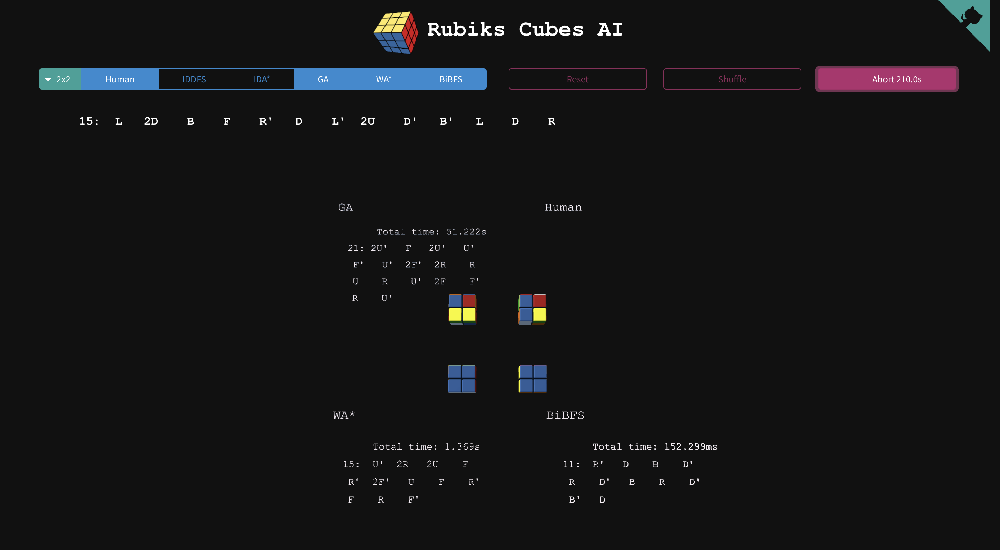
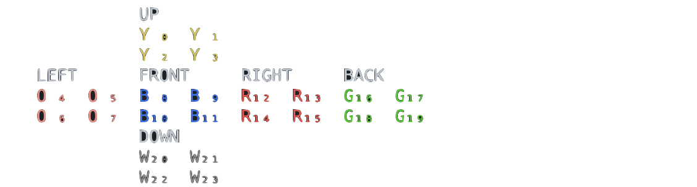
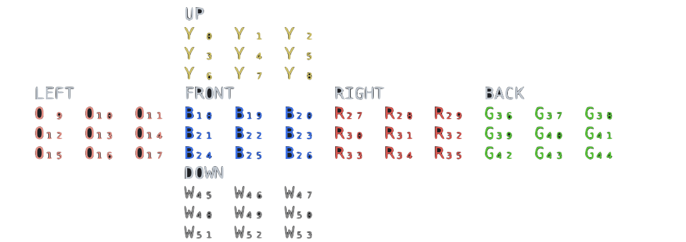
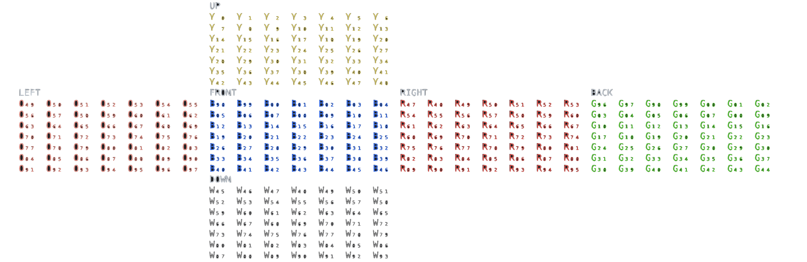

# Rubiks cubes AI

This project allows you to play/solve a Rubik's cube inside a program. By using the buttons and keys, you can rotate the cube and change its configuration. Once you click on solve the algotithms will run.

### Keys
Twist the faces of the cube using these keys: **W**, **A**, **S**, **D**, **F**, and **X** for up, left, front, right, back, and down twists, respectively. Hold **Shift** for prime (counter-clockwise) moves. Use any number key to change the layer on which the rotation will perform. Bear in mind that the layer rotation is limited by the cube dimension (there is no way to rotate a middle layer in a 2x2 cube, since it has no middle layer, for instance).

Press **\]** to quickly scramble the cube and **\\** to restore its original configuration.

### Mouse
Use the mouse left button, right button and scroll to handle the camera.

#### --asdasd Add 7x7 gif

### Goals
This project was created for fun and studying purposes. These were the mains goals behind it:

1. Have fun.
1. Study 3D in browser environments using [threejs](https://threejs.org/)
1. Solve a Rubiks cube without any human supervised technique:
    - No previous set of rotations
    - No precomputed databases
    This characteristic pretty much makes it impossible to solve any other cube than the pocket one (2x2x2). Hence, every other cube is displayed only for recreationsl purposes.
1. Experimenting with different search algorithms and compare them. Namely:
    - **[Interative-deepening depth-first-search](./src/solvers/2x2/iterative-deepening-depth-first-search-solver.ts)**: It doesn't keep a list of already visited so it's very efficient memory-wise. However it revisits same nodes several times. Given enough time, guaranteed to find the optimal answer.
    - **[Interative-deepening A star](./src/solvers/2x2/iterative-deepening-a-star-solver.ts)**: In short, IDA* works similarly like a regular iterative deepening search, but instead of exploring every node, it utilizes heuristics to prune some branches in the search three. As such it is very memory efficient and it provides an optimal solution as long as the heuristics is admissible. IDA* search uses heuristics to prune branches which are guaranteed to lack a solution within the allowed depth. As heuristics calculation made with pattern databases is not consistent, it is possible to have a situation where IDA* will explore the subtree of what will appear to be a good node, too much. That will happen when the node has an excessively underestimated heuristics value. It doesn't keep a list of already visited so it's very efficient memory-wise. However it revisits same nodes several times. Given enough time, guaranteed to find the optimal answer.In fact, it has no guarantee at all that a solution will be found. Thus, if it takes too long to find it, it restarts from the beginning.
    - **[Simulated Annealing](./src/solvers/2x2/simulated-annealing/simulated-annealing-solver.ts)**: Physics-based metaheuristic. given a pocket cube current status, generate a set of a list of random actions and, using Genetic Algorithm, slowly improve them until a single list of actions that solve the cube is found. It uses the number of misplaced stickers as fitness function. Often times find redundant moves since it doesnt care about irrelevant twists or twists that cancel each other. Heavily based on luck. Would not be efficient for larger cube sizes. It would take forever. 
    Random movements improved by simulated annealing algorithm. Uses number of misplaced stickers as a measure of a solution candidate result. Population: ${SimulatedAnnealingConfig.population}. Initial temperature: ${SimulatedAnnealingConfig.initialTemperature}. Temperature decrease rate: ${SimulatedAnnealingConfig.temperatureDecreaseRate}` Non-deterministic algorithm, meaning that it won't get the same result in every run. In fact, it has no guarantee at all that a solution will be found. Thus, if it takes too long to find it, it restarts from the beginning. Previous knowledge is needed. Since I know the God's number for this dimension is 14, the candidates have to be a solution rotations set greater than this number. The greater, the faster and the better time considering but, evidently, worse for spacial constrains. That's why I set this number to 30. You can see it has some redundant moves.
    - **[Genetic Algorithm](./src/solvers/2x2/genetic-algorithm/genetic-algorithm.ts)**: Evolutionary-based  metaheuristic. given a pocket cube current status, generate a set of a list of random actions and, using Genetic Algorithm, slowly improve them until a single list of actions that solve the cube is found. It uses the number of misplaced stickers as fitness function. Often times find redundant moves since it doesnt care about irrelevant twists or twists that cancel each other. Heavily based on luck. Would not be efficient for larger cube sizes. It would take forever.  Non-deterministic algorithm, meaning that it won't get the same result in every run. Previous knowledge is needed. Since I know the God's number for this dimension is 14, the candidates have to be a solution rotations set greater than this number. The greater, the faster and the better time considering but, evidently, worse for spacial constrains. That's why I set this number to 30. You can see it has some redundant moves.
    - **[Weighted A star](./src/solvers/2x2/weighted-a-star-solver.ts)**: Keeps a list of visited nodes and not efficient for larger cube sizes. No reexploration. Which means that, if, while it's searching for the final path, it finds a better path to a already visited node, it doesn't reanalyze it and its children path. In order to avoid cycles and reentrance, it keeps a list of every visited node. So it can easily fills any machine memory if it's used for larger scopes such as rubiks cubes (any dimension bigger than 2x2, as a matter of fact)
    - **[Bidirectional breadth-first-search](./src/solvers/2x2/bidirectional-breadth-first-search-solver.ts)**: As we know the desired goal state and the initial cube state we can employ two simultaneous Breath First Searches - one going forward from the initial state and one backward from the goal state, stopping when they meet. In doing this we provide a means to restrict the branching which occurs when the search is being performed, into seperate two sub-graphs - dramatically reducing the amount of exploration required.
    Suppose if the branching factor of the tree is b and distance of the goal vertex from the source is d, then the trivial Breath First Search complexity would be O(bd). On the other hand, if we execute two search operations then the complexity would be O(bd/2) for each search, with a total complexity of O(bd/2 + bd/2) - which is far less than O(bd).  In order to avoid cycles and reentrance, it keeps a list of every visited node. So it can easily fills any machine memory if it's used for larger scopes such as rubiks cubes (any dimension bigger than 2x2, as a matter of fact)
    Keeps a list of visited nodes and not efficient for larger cube sizes. Very effective for small scopes. Deterministic, doesn't use any heuristic function. So doesn't require any prior information rather than knowing if the cube is in a solved state, but useless in larger scopes (aka bigger cubes) due to its memory limitations.

----

## Rubik's cube twist notation
Rubik's cube's standard twist notation is: U, L, F, R, B and D desribe 90-degree clockwise twists of the up, left, front, right, back, and down faces, respectively. Adding an apostrophe indicates a counter-clockwise twist, so U' means twist the up face 90-degrees counter-clockwise. Prefixing a 2 to a move indicates a double 90-degree twist, or a 180-degree twist; 2F means to twist the front face twice. Larger cubes require an additional notation to describe intern layers notation. We achieve this by using subscript letters (₁₂₃...₈₉) to identify wchich layer was twisted.

## Rubik's cube representation
There are several ways to represent a Rubik's cube as an object structure. Each one having having its pros and cons and differ from each other in characteristics as complexity, memory usage and manipulation.

The one I chose represents all cubes with an unidimensional array. For instance, a solved pocket cube with the top and front faces being yellow and blue respectively is stored as:

The formula: `(cube dimension * cube dimension) * 6`
So, a 2x2 cube is represented as a 24 sized string, where every index contains the initial of the color it represents.

So the pocket cube is the string: `YYYYOOOOBBBBRRRRGGGGWWWW`  
Distributed like this:

The regular one, also having the top and front faces being yellow and blue respectively is:
So the pocket cube is the string: `YYYYYYYYYOOOOOOOOOBBBBBBBBBRRRRRRRRRGGGGGGGGGWWWWWWWWW`  
Distributed like this:

And, ultimately, just as a curiosity: `YYYYYYYYYYYYYYYYYYYYYYYYYYYYYYYYYYYYYYYYYYYYYYYYYOOOOOOOOOOOOOOOOOOOOOOOOOOOOOOOOOOOOOOOOOOOOOOOOOBBBBBBBBBBBBBBBBBBBBBBBBBBBBBBBBBBBBBBBBBBBBBBBBBRRRRRRRRRRRRRRRRRRRRRRRRRRRRRRRRRRRRRRRRRRRRRRRRRGGGGGGGGGGGGGGGGGGGGGGGGGGGGGGGGGGGGGGGGGGGGGGGGGWWWWWWWWWWWWWWWWWWWWWWWWWWWWWWWWWWWWWWWWWWWWWWWWW`  

Not the most efficient way, but it gets the job done.

The rotation is then done by changing colors in the array with each other. Obviously, there is a pattern that must be followed to achieve this. Just keep in mind that the colors are changed the index stay the same. Rotation can be made to each face on two directions clockwise and anti-clockwise.
So basically, when a rotation is performed the colors inside the array are changed accordingly.

If every tile of each face have a matching color, the cube is solved.

## Pocket Cube technicalities (2x2x2)
There is plenty of prior art in this space, and thanks to some key characteristics of a 2x2x2 Pocket Cube, optimally solving a given cube state is not too computationally intensive. The Pocket Cube consists of 8 cubies/cubelet, each with three colour stickers on them, resulting in a 24 total stickers. Any permutation of the cubies is possible, with seven of these being able to be independently oriented in three ways. If we fix one of these cubies to a chosen position and orientation (essential deeming it to be in a solved state); we can permit any permutation of the remaining seven cubies and any orientation of six cubies. This results in their only being 7! * 3⁶ = 3,674,160 possible unique states. Which, in itself, makes it computational feasible to visit each possible move sequence in an adequate time by any modern computer configuration.

    
The cube consists of 8 smaller cubies, each one with 3 color stickers on it. Any permutation of the cubies is possible, and 7 of them can be independently oriented in three ways. If we fix one cubie to have a chosen position and orientation, we can allow any permutation of the remaining 7 cubies and any orientation of 6 cubies (the orientation of the first cubie is fixed, 6 cubies can be independently oriented, and the orientation of the last one is determined by the other). The number of possible states is:

        3,674,160

This is a fairly small amount of states, and it can be easily saved in a computer memory, in which case the search algorithm becomes trivial. As the purpose of this experiment was to try different search algorithms, the amount of memory was intentionally limited.

In case of a standard Rubik's cube, the number of possible states is vastly larger, and enumerating all the states is infeasible.

## General solution approach
In this particular cube, you don't have to move all the sides (6) both directions. If the L move basically consists of a R' move and a new cube orientation (which is not a move, technically), you don't need to do the L move at all. The same applies for the other 2 axis. So, instead of having a branching factor of 2⁶, I make it 2³. Whenever possible and taking advantage of the pocket cube especific characteristics, most solutions fix a a deliberately chosen cubelet. By doing that one can solve a  pocket cube rotating only three of the six faces, these being Up, Right and Front - in my case - resulting in the Down-Bottom-Left DBL cubelet staying in-place at all times. As long as one predefined cubelet remains static (bottom-left-back one) we keep the branching factor small and, as such, employing a convention Graph search algorithm over the search space provides us with a efficent means to reach a solution move sequence.

Given that, for a pocket cube, the God's number using quarter-turn metric is **14**. You'll often find times that the path found by these algorithms are not optimal.
 Namely Genetic Algorithm and WA* don't find the best answer because they don't look for the best answer to solve the cube. They look for the the fattest one to answer to solve the cube with a given configuration and some non-deterministic values. I could even claim that R' is the same 3R, as in fact it is. It would make the branching factor 3¹, so even smaller. But the solutions found would be even farther from the optimal one,

## Report

15 executions of a pocket cubes scrambled with 30 random moves. Worth noting that Every alg runs simultaneously in the same machine in a different thread competing for the same resources and once one algorithm finishes, the other ones have less resource competition.
Other than that, in order to theses numbers get gathered, some flags and procedures were added/enable to the code which, ironically, make them run a bit slower.

### Machine configuration:

- MacOS Ventura 13.2.1
- Model Name:	MacBook Air
- Processor:
    - Chipset Model:	Apple M2
    - Type:	GPU
    - Total Number of Cores:	10
    - Vendor:	Apple (0x106b)
    - Metal Support:	Metal 3
    - Total Number of Cores:	8 (4 performance and 4 efficiency)
- Memory:	8 GB (LPDDR5)
- Storage: 500GB SSD

Once you click on solve the alogirthms will run individually in a different thread each, competing for the same machine resources.

| Algorithm | Time average (max, min, std. dev) | Nodes visited average (max, std. dev) | Optimal solution rate | Solution compared to optimal avg  (max, std. dev)  | Spacial complexity |
|-----|-----|-----|-----|-----|-----|
| IDDFS | | | 100% | 1 (0) | Constant |
| IDA* | | | 100% | 1 (0) | Constant |
| GA | | | | | Constant |
| SA | | | | | Constant |
| WA* | | | | | Exponential |
| BiBFS | | |  100% | 1 (0) | Exponential |

